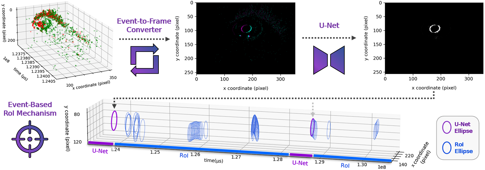

# E-Track: Eye Tracking with Event Camera for Extended Reality (XR) Applications



This repository contains the code for the paper "[E-Track: Eye Tracking with Event Camera for Extended Reality (XR) Applications](https://ieeexplore.ieee.org/document/10168551)" by Nealson Li, Ashwin Bhat and Arijit Raychowdhury (AICAS 2023). If you use our code or refer to this project, please cite it using

```
@INPROCEEDINGS{10168551,
  author={Li, Nealson and Bhat, Ashwin and Raychowdhury, Arijit},
  booktitle={2023 IEEE 5th International Conference on Artificial Intelligence Circuits and Systems (AICAS)}, 
  title={E-Track: Eye Tracking with Event Camera for Extended Reality (XR) Applications}, 
  year={2023},
  pages={1-5},
  doi={10.1109/AICAS57966.2023.10168551}}
```


## Enviroment Setup
For our implementation, Python version 3.8 with CUDA version 10.1 and Tensorflow-GPU version 2.6.0 are used. Install the project
requirements with:
```
conda create -n e_track python=3.8
conda activate e_track
python -m pip install -r requirements.txt
```

## Data
The dataset used for training the pupil event classification U-Net are the tfrecords in folder `data`. To download the raw dataset please use the setup script. Since subjects 1-3 were recorded with a different setup, subjects 4-27 are used in the paper to maintain the consistancy with the previous work.
```
bash setup.sh
```

## Training and Predicting with U-Net
To train or predict with the pupil event classification U-Net, configure `modle/e_track_unet.py` to train or predict and run command:
```
python e_track_unet.py
```

## Run E-Track algorithm
To run the full E-Track event based eye-tracking algorithm with the Event-to-Frame Converter, Pupil Event U-Net and Event-Based RoI Mechanism, run command:
```
python e_track.py
```
